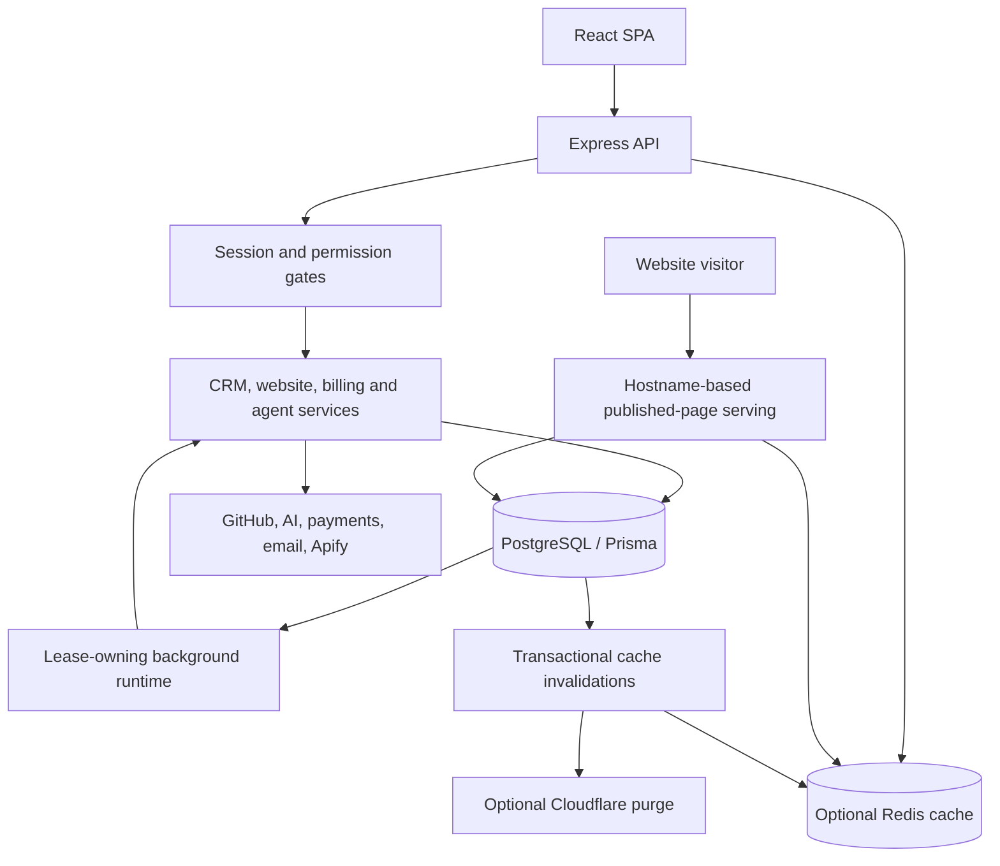

# DakyXTech OS architecture and code audit

Date: 2026-09-28. Checkout: `repo`, baseline commit `319bd42`, including the working tree's existing changes.

## Implementation update

The September 29 fixes and verification results are recorded in [AUDIT_FIXES.md](AUDIT_FIXES.md). The findings below retain the original audit evidence; consult that report for current status.

## Scope and confidence

This is a repository-wide architecture review with targeted source inspection and executable regression checks. It is not a claim that every line or every user journey has been verified. The inventory covered 473 TypeScript/JavaScript source files under the server, client, scripts, and Apify directories, excluding dependencies and build output. There were 178 changed or untracked files before this work. Findings describe that working tree, not just the committed release.

Runtime findings below distinguish demonstrated defects from risks inferred from source. No production services, credentials, migrations, payment providers, or customer data were exercised. No deployment or commit was made.

## Architecture

The application is a modular monolith with an emerging API/worker split. PostgreSQL is the system of record. Redis is an optional response cache; it is not the durable work queue. The queue, ownership leases, publication state, and invalidation outbox live in PostgreSQL.

| Area | Responsibility and main locations |
| --- | --- |
| Client | React Router, lazy pages, React Query, session identity and queued-job polling. `server/client/src/App.tsx`, `lib/api.ts`, `lib/auth.tsx`. |
| HTTP composition | `server/src/index.ts` orders host serving, raw webhooks, public routes, authentication, protected routes, and SPA delivery. It also performs substantial startup work. |
| Access control | Cookie sessions, roles, permissions, and site membership. `lib/session.ts`, `middleware/auth.ts`, `middleware/permissionGate.ts`, `services/websiteAccess.ts`. |
| CRM | Leads, imports, proposals, clients, projects, invoices, and care plans, implemented through routes and shared services. |
| Website editing | HTML parsing and region discovery, JSX literal editing, draft revisions, shared elements, source retrieval, publication history, and hosting. `services/website/*`, `routes/website.ts`, `services/websiteShared.ts`. |
| Automation | Agent task claiming, checkpoints, model calls, tool permissions, approval gates, and cost records. `services/agents/*`, `services/tools/*`, `lib/models/*`. |
| Background execution | `worker.ts`, `services/backgroundRuntime.ts`, `services/scheduler.ts`, and `services/websiteWorkQueue.ts`. API-only instances skip background ownership. |
| Persistence | Prisma schema and migrations, plus explicit SQL for leases, locking, sessions, and transactional invalidation triggers. |
| External assets | GitHub for connected website source; Cloudinary integrations for hosted media/documents; a separate Apify screenshot actor using Playwright and Sharp. |
| Public marketing site | Root scripts generate articles, SEO metadata, breadcrumbs, and validate links/consent independently of the SPA build. |
| Verification | Type checks, database-backed checks, browser checks, security scans, and builds in `.github/workflows/security.yml`. |

## End-to-end flows

1. **Authenticated operations:** React calls `/api` with an HTTP-only session cookie. The server resolves the session and current permissions, applies route and site gates, validates input, and reads or writes through Prisma. React Query handles client data state. The API helper aborts obsolete requests after an account change and temporarily bypasses cached reads following mutations.
2. **Website editing and publishing:** Site access and entitlement checks precede source discovery. Source comes from stored HTML, GitHub, committed build output, an optional render service, or a public live page. Region/JSX adapters discover editable literals. Draft revisions and source hashes detect conflicts. Publishing acquires database locks, prepares output, records a publication job, writes GitHub or stored HTML, and updates history and audit records. Background verification distinguishes a repository commit from a completed deployment.
3. **Queued website work:** When admission is enabled, requests reserve quota and an idempotency key inside a transaction, then return HTTP 202. The client polls the job. Workers recheck user access and entitlement, claim leased work, and record whether external execution began. Interrupted external work can require reconciliation instead of automatic retry.
4. **Published website delivery:** Hostname resolution selects a site before the internal application middleware. Published pages come from PostgreSQL through optional Redis caching. ETags reduce repeated transfers. Database triggers write invalidations in the same transaction as content changes; consumers clear local state, rotate Redis generations, and optionally purge Cloudflare.
5. **Payments:** Checkout creation reserves a `PaymentAttempt`. Paystack callbacks enter durable storage before acknowledgement; processing verifies provider results. Settlement uses an atomic invoice status transition and updates lifetime value once. Stripe and Hubtel callback handling follow a weaker acknowledgement path described below.
6. **Agent and outreach work:** The lease-owning scheduler starts due work. Agent loops use checkpoints, budgets, model adapters, and tool invocation gates. Outward actions pass readiness, grant, autonomy, and approval decisions. Mailbox ingestion and provider callbacks update conversations and follow-up state.

## Prioritized findings

### P1 — Payment callbacks can acknowledge work that is not durably complete

**Evidence:** `server/src/index.ts:165` sends the Stripe acknowledgement before `settleManually` at line 176. `server/src/routes/paymentWebhooks.ts:68` acknowledges Hubtel before verification/settlement at line 76. Audit-record writes catch and suppress storage failures. The Stripe route also awaits configuration outside an enclosing error-forwarding block.

**Impact:** A process interruption or settlement failure after HTTP 200 can leave a paid invoice unsettled without prompting provider delivery retries. An audit row alone is not a demonstrated replay mechanism. Unlike the Paystack handler, these paths do not establish a durable processing queue before acknowledgement.

**Strategy:** Reuse the durable-inbox pattern already present in `services/paystackEvents.ts`: provider delivery identity, payload validation/redaction, persistence before acknowledgement, explicit processing state, retry schedule, and reconciliation. Keep provider verification separate. Add crash-after-ingestion and duplicate-delivery tests. Verify Stripe payment status, amount, currency, and invoice association before settlement; the current handler passes metadata directly to manual settlement. This review did not exercise a payment provider.

### P1 — Public asset lookup lacks site and publication scoping

**Evidence:** `server/src/index.ts` mounts `/assets/dw/:filename` before authentication and selects `siteAsset.findFirst({ where: { repoPath } })`. The schema's uniqueness boundary is `(siteId, repoPath)`. The hosted-site path in `services/websiteHosting.ts` instead selects by site and checks published-page usage.

**Impact:** The unscoped route can return a draft asset by a known filename and can select an asset from the wrong site when paths collide. Filename entropy reduces guessing but does not establish authorization or publication state.

**Strategy:** Define the legacy route's intended site explicitly, scope lookup to that site, and require publication eligibility. Preserve existing published URLs through a scoped compatibility resolver. Add two-site collision and unpublished-asset tests before changing this externally visible route.

### P1 — Configuration depends on module initialization order — fixed

**Evidence:** The first import in `server/src/index.ts` is `lib/capacity.ts`; `dotenv/config` appears later. Capacity values are captured at module initialization. Previously, values available only in `.env` could be ignored, including the service role.

**Change:** `lib/capacity.ts` now loads `dotenv/config` before reading settings. This makes the configuration module responsible for its initialization requirement and preserves environment-variable precedence.

**Proof:** `checks/capacityEnvironment.ts` starts fresh subprocesses against an isolated temporary `.env`. It checks worker role, concurrency, and rejection of invalid configuration. It does not boot the application.

### P2 — Publishing holds transactions across external work

**Evidence:** `services/websitePublishing.ts` permits 90-second single-page and 120-second multipage transactions. `routes/website.ts:852` enters that transaction; source retrieval, GitHub branch creation, publication, and pull-request creation occur inside its callback. Some helper operations use the shared Prisma client rather than the transaction client.

**Impact:** Slow external services occupy pooled database connections and publication locks. With small pools, unrelated requests can queue. Shared-client helper calls are not rolled back with the enclosing transaction. Existing publication jobs and reconciliation help recovery but do not remove these costs.

**Strategy:** Evolve the existing publication state machine: short transaction to reserve a revision and fenced lease; external preparation/commit outside the transaction; short conditional transaction to finalize that revision. Persist provider commit identity before reporting success. Test concurrent edits, worker death, provider timeout, and finalize failure before replacing the current locks.

### P2 — Cache serialization can fail successful source reads — fixed

**Evidence:** `lib/cache.ts` originally serialized loader results outside failure handling. Circular values, BigInt, or a throwing `toJSON` caused rejection after the source read succeeded. A future-expiring envelope without `value` was accepted. Existing cached nulls ignored `cacheNull: false` on reads.

**Change:** Serialization failure now increments the cache error metric and returns the original source result. Undefined results are not cached. Reads require a value-bearing envelope with a finite future expiry and honor the null policy. Source errors still propagate; this change does not hide database failures.

**Proof:** `checks/cacheResilience.ts` covers all these cases, source-error propagation, recovery after failure, and a subsequent valid cache hit. Current inspected endpoint loaders mostly return serializable data; the serialization issue is a demonstrated generic-cache defect, not a measured production incident.

### P2 — Rate limiting scales per process and can scan growing maps

**Evidence:** `middleware/security.ts` stores counters in local `Map` instances. Above 5,000 keys, each new key iterates the map to remove expired entries. Unexpired keys have no hard size bound.

**Impact:** Adding API replicas multiplies the effective allowance. A stream of distinct active keys grows memory and repeatedly scans the map. The code comment assumes one service, while the new deployment design supports separate roles and replicas.

**Strategy:** Apply authoritative limits at a trusted ingress or shared atomic store. Keep a bounded local emergency limiter with periodic expiration and explicit behavior when the shared store is unavailable. Preserve account-level limits and trusted-proxy semantics. Load-test distinct-key traffic, not just repeated requests from one IP.

### P2 — Database work grows with list and invalidation volume

**Evidence:** The grouped lead view in `routes/leads.ts:340` performs one lead query per nonempty displayed group using `Promise.all`. It also compares every group to aggregated rows when finding empty groups. `services/cacheInvalidation.ts` repeatedly finds events not containing a per-process UUID and appends that UUID to `observedBy`.

**Impact:** Group views fan out into concurrent database queries. Invalidation writes increase with both events and replicas, and restarting a consumer creates a new identity. This is a scaling risk; no production query plans were measured.

**Strategy:** Replace repeated group membership searches with a Set. Benchmark a single query using `row_number()` partitioned by group to preserve the per-group limit, or bound query concurrency first. For invalidation, consider durable per-consumer cursors or a broadcast mechanism with a catch-up watermark and bounded retention. Preserve the transactional outbox as the authority.

### P2 — Large modules and reversed dependencies increase change risk

**Evidence:** Source sizes include `WebsiteEditor.tsx` at 231,331 bytes, `Settings.tsx` at 182,558, `agents/runner.ts` at 150,355, and `websiteBuilderAgent.ts` at 122,487. `websiteWorkQueue.ts` imports publication executors from `routes/website.ts` and constructs partial Express requests to call them. `routes/imports.ts` imports its Google callback from `routes/settings.ts`.

**Impact:** Worker execution depends on HTTP-shaped objects and router initialization. Large files combine UI state, orchestration, permissions, persistence, and formatting. Shared-client and transaction-client use becomes difficult to review.

**Strategy:** Extract application commands accepting typed actor, site, input, and execution context values. HTTP routes validate and adapt; workers call the same commands. Move OAuth callbacks into an integration service. Split editor state into focused hooks and panels without rewriting its document model. Avoid creating another service layer that merely forwards every call.

### P3 — Duplicated orchestration and contracts invite drift

**Evidence:** Single-page and multipage lock helpers repeat transaction/lock handling. Page, version, shared-element, and batch publication have separate orchestrations. API and worker shutdown paths differ. The client maintains a large handwritten `lib/types.ts` alongside server validation schemas. These are overlap and drift risks, not proof that superficially similar business operations are interchangeable.

**Strategy:** First characterize distinct behavior, then extract shared lock acquisition, publication transitions, and shutdown deadlines. Generate or share transport schemas for a small endpoint family first. Keep UI presentation models separate from Prisma persistence types. Do not merge provider-specific verification rules merely to reduce line count.

### P3 — Scheduled work can overlap and editor bundles remain large

**Evidence:** `services/scheduler.ts` starts `tick()` from `setInterval` without a top-level in-flight guard. Individual jobs may have their own claims, so this is an overlap risk rather than proof of duplicate sends. The production build emitted a 328.67 kB editor chunk (87.22 kB gzip), in addition to shared chunks; route-level lazy loading is already present.

**Strategy:** Track task duration and overlap before deciding between per-task exclusion and completion-based scheduling. Preserve existing durable claims. Profile editor interaction and split infrequently used panels only where measured loading or rendering costs justify it. Bundle size alone does not establish a slow interaction.

## Refactoring sequence and preservation gates

1. Ship the small cache/configuration fixes with their regression checks.
2. Address callback durability and public asset scoping with isolated database and HTTP integration tests. Preserve settled-invoice idempotency and existing published asset URLs.
3. Extract website application commands from routes. Reuse them from synchronous requests and queued jobs. Verify identical access decisions, response bodies, draft retention, and version history.
4. Move publication network work outside long transactions using the existing job records plus fencing. Require crash-recovery and concurrent-edit tests before rollout.
5. Measure grouped-list queries, invalidation backlog, database pool waits, scheduler overlap, and high-cardinality rate limiting. Optimize the largest observed costs.
6. Break up editor/settings modules and introduce shared transport contracts incrementally. Retain browser checks for editing, preview, source fidelity, and publishing.

No broad rewrite is justified by this review. Existing revision checks, durable queues, publication reconciliation, session hashing, permission gates, safe website fetching, and CI checks are valuable foundations to preserve.

## Changes and verification

Production changes: `server/src/lib/capacity.ts` and `server/src/lib/cache.ts`. Both already existed as untracked work before this audit. New regression checks: `server/checks/capacityEnvironment.ts` and `server/checks/cacheResilience.ts`. Existing user edits were retained.

Passed locally:

- Server TypeScript check: `npm exec -- tsc --noEmit -p tsconfig.json` before changes; the post-change check below also includes server sources.
- Server and check TypeScript validation: `npm run checks:types`, including both new checks.
- Cache resilience regression: `node --import tsx checks/cacheResilience.ts`.
- Environment initialization regression: `node --import tsx checks/capacityEnvironment.ts`.
- Existing cache regression: `node --import tsx checks/capacityCache.ts`, covering isolation, coalescing, invalidation races, size limits, outage fallback, and admission.
- Client production build: `npm run build` in `server/client`; 206 modules transformed.

The full database-backed suite, real Redis mode, browser suite, external-provider tests, dependency advisory scan, and production load tests were not run. Those remain necessary before claiming full behavioral equivalence or production readiness. Repository-wide `git diff --check` reports existing extra EOF blank lines in `WebsiteIcons.tsx` and `websiteSectionTemplates.ts`; neither was changed by this audit.
